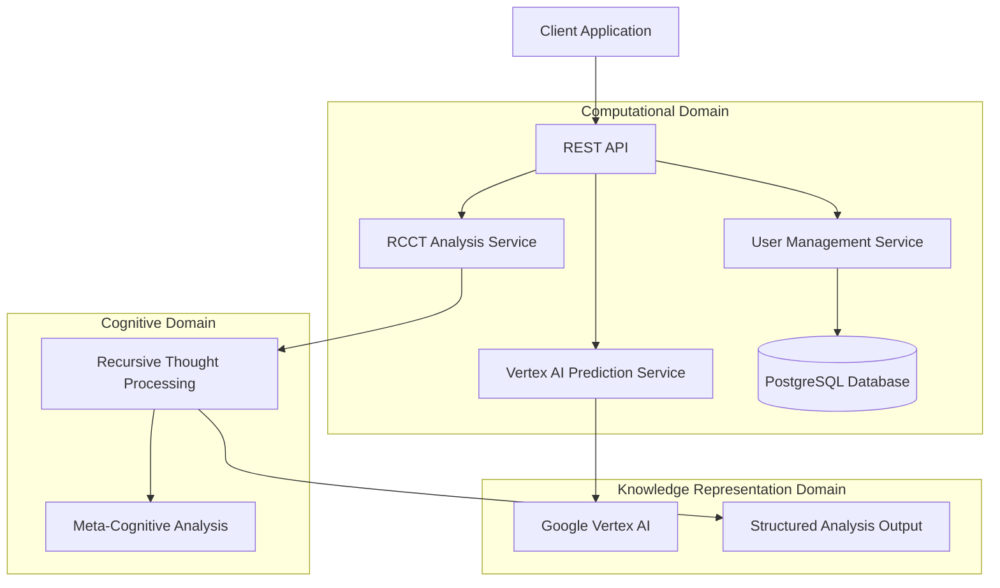

# Polyglot Architecture with Go, Java, Mojo, and Postgres

A sophisticated polyglot service architecture demonstrating how multiple programming languages can be combined to create an optimized system leveraging the strengths of each language:

1. **Go**: API Gateway and legacy database access layer
2. **Java**: Type-safe REST API with generic implementations
3. **Mojo**: High-performance database service with SIMD optimizations (gRPC)
4. **Postgres**: Relational database backend
5. **Vertex AI**: Machine learning integration for user analysis
6. **RCCT**: Recursive Cognitive Chain of Thought framework for structured analysis

## Architecture Overview

The system follows a polyglot architecture with clear separation of concerns:

```
┌───────────────┐        ┌───────────────┐        ┌───────────────┐
│               │        │               │        │               │
│   Go API      │◄─────► │   Java User   │◄─────► │   Mojo DB     │
│   Gateway     │   REST │   Service     │   gRPC │   Service     │◄─────► PostgreSQL
│               │        │               │        │               │
└───────────────┘        └───────────────┘        └───────────────┘
        ▲                                                 ▲
        │                                                 │
        │                                                 │
        ▼                                                 │
┌───────────────┐                                         │
│               │                                         │
│   Vertex AI   │◄────────────────────────────────────────┘
│               │
└───────────────┘
```

Original architecture using the RCCT framework:



## Components

### Go API Gateway
- Provides a unified entry point for client applications
- Routes requests to appropriate services
- Integrates with Vertex AI for advanced analytics
- Acts as an adapter for the Java REST service
- Includes legacy implementation of database access and RCCT framework

### Java User Service
- Type-safe implementation with generics
- Handles REST API requests for user operations
- Communicates with the Mojo database service via gRPC
- Spring Boot application with enterprise features
- Abstract generic classes for maximum code reuse

### Mojo Database Service
- High-performance database operations using SIMD optimizations
- Exposes gRPC interface for type-safe communication
- Handles database connections and query execution
- Provides structured error handling and data validation

### Postgres Database
- Relational database for persistent storage
- Handles user data with proper constraints
- Accessible only to the Mojo database service

### Vertex AI Integration
- Machine learning model predictions
- Provides user behavior analysis
- Connected through both Go and Mojo services

### RCCT Framework
- Structured cognitive analysis
- Recursive thought processing
- Meta-cognitive reflection

## Running the Application

### Prerequisites
- Docker and Docker Compose
- Go 1.21+
- Java 17+
- Mojo SDK
- PostgreSQL 15+

### Development Mode
```bash
# Run in example mode
go run main.go

# Run Go server only (legacy mode)
go run main.go server

# Run proxy mode (API Gateway)
go run main.go proxy

# Show polyglot architecture info
go run main.go polyglot
```

### Docker Compose
```bash
# Start all services
docker-compose -f docker/docker-compose.yml up

# Start in detached mode
docker-compose -f docker/docker-compose.yml up -d

# Stop services
docker-compose -f docker/docker-compose.yml down
```

## API Endpoints

### User Management
- `GET /api/users` - List all users with pagination
- `GET /api/users/{id}` - Get user by ID
- `POST /api/users` - Create a new user
- `PUT /api/users/{id}` - Update an existing user
- `DELETE /api/users/{id}` - Delete a user

### Additional User Operations
- `GET /api/users/search?username={pattern}` - Search users by username
- `GET /api/users/by-email?email={email}` - Find a user by email
- `GET /api/users/by-type/{userType}` - Find users by type
- `PATCH /api/users/{id}/active?active={bool}` - Update user's active status
- `PATCH /api/users/{id}/type?userType={type}` - Update user's type

### Analysis
- `GET /api/analyze/user/{id}` - Analyze user with Vertex AI
- `POST /api/analyze` - Perform structured analysis using RCCT framework

## Project Structure
```
.
├── api/             # Go API Gateway implementation
├── db/              # Legacy Go database implementation
├── docker/          # Docker configurations
│   ├── docker-compose.yml
│   ├── go.Dockerfile
│   ├── java.Dockerfile
│   └── mojo.Dockerfile
├── java/            # Java User Service
│   ├── src/
│   └── pom.xml
├── mojo/            # Mojo Database Service
│   └── db_service.mojo
├── models/          # Shared data models
│   ├── rcct.go      # RCCT framework models
│   └── user.go
├── proto/           # Protocol Buffers definitions
│   └── user.proto
├── vertex/          # Vertex AI integration
├── go.mod
├── go.sum
├── main.go
└── README.md
```

## Benefits of Polyglot Architecture

This architecture demonstrates several key benefits:

1. **Leveraging language strengths**: Using each language for what it does best
   - Go: API Gateway, middleware, and concurrent operations
   - Java: Type-safe enterprise-grade business logic
   - Mojo: High-performance data processing with SIMD optimization
   - Python: ML/AI model integration (via Vertex AI)

2. **Separation of concerns**: Each component has clear responsibilities
   - API Gateway: Request routing and transformation
   - User Service: Business logic and validation
   - Database Service: Data access and storage optimization
   - Postgres: Persistent storage with guarantees

3. **Scalability**: Components can be scaled independently
   - Multiple instances of Java User Service for horizontal scaling
   - Single database service with connection pooling
   - Multiple API Gateways for load balancing

4. **RCCT Framework**: The system integrates the Recursive Cognitive Chain of Thought framework:
   1. **Understanding** - Initial comprehension of the problem
   2. **Analysis** - Deep analysis of key components
   3. **Exploration** - Exploration of solution space
   4. **Solution Formulation** - Development of concrete solutions
   5. **Reflection** - Meta-cognitive reflection on the process

## Configuration

Set these environment variables for the legacy single-service mode:

- `PROJECT_ID` - Google Cloud project ID
- `REGION` - Google Cloud region
- `ENDPOINT_ID` - Vertex AI endpoint ID
- `PORT` - Server port (default: 8080)

See docker-compose.yml for polyglot architecture configuration.